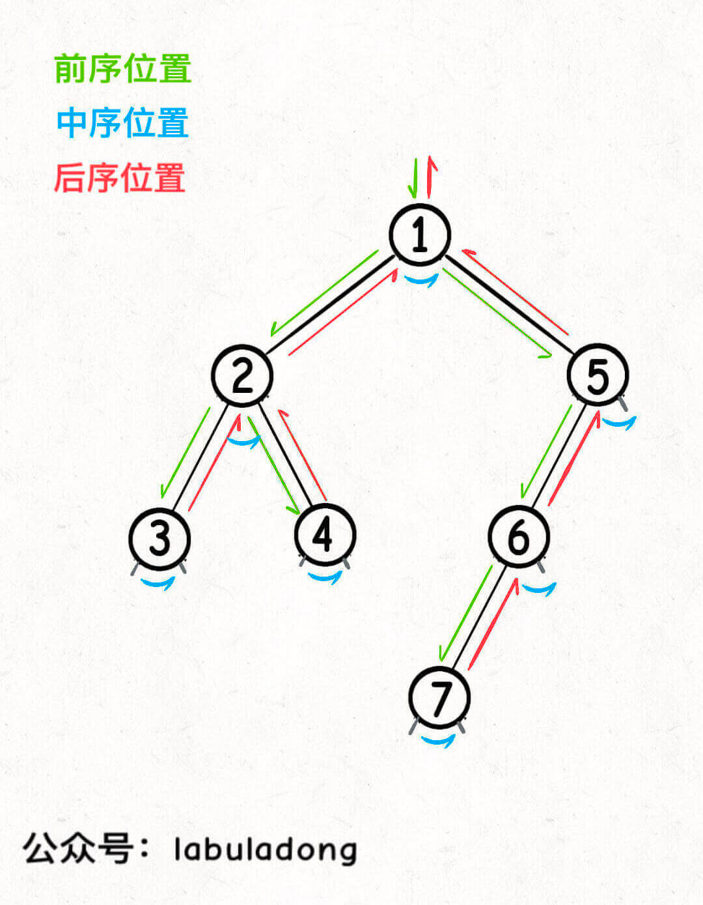

# 二叉树

二叉树遍历框架

```c++
void traverse(TreeNode root) {
    if (root == null) {
        return;
    }
    // 前序位置
    traverse(root.left);
    // 中序位置
    traverse(root.right);
    // 后序位置
}
```

先不管所谓前中后序，单看 traverse 函数，你说它在做什么事情？

其实它就是一个能够遍历二叉树所有节点的一个函数，和你遍历数组或者链表本质上没有区别

```c++
/* 迭代遍历数组 */
void traverse(int[] arr) {
    for (int i = 0; i < arr.length; i++) {

    }
}

/* 递归遍历数组 */
void traverse(int[] arr, int i) {
    if (i == arr.length) {
        return;
    }
    // 前序位置
    traverse(arr, i + 1);
    // 后序位置
}

/* 迭代遍历单链表 */
void traverse(ListNode head) {
    for (ListNode p = head; p != null; p = p.next) {

    }
}

/* 递归遍历单链表 */
void traverse(ListNode head) {
    if (head == null) {
        return;
    }
    // 前序位置
    traverse(head.next);
    // 后序位置
}

```

单链表和数组的遍历可以是迭代的，也可以是递归的，二叉树这种结构无非就是二叉链表，由于没办法简单改写成迭代形式，所以一般说二叉树的遍历框架都是指递归的形式。

你也注意到了，只要是递归形式的遍历，都可以有前序位置和后序位置，分别在递归之前和递归之后。

所谓前序位置，就是刚进入一个节点（元素）的时候，后序位置就是即将离开一个节点（元素）的时候

比如说，如果让你倒序打印一条单链表上所有节点的值，你怎么搞？

实现方式当然有很多，但如果你对递归的理解足够透彻，可以利用后序位置来操作：

```c++
/* 递归遍历单链表，倒序打印链表元素 */
void traverse(ListNode head) {
    if (head == null) {
        return;
    }
    traverse(head.next);
    // 后序位置
    print(head.val);
}
```
前中后序是遍历二叉树过程中处理每一个节点的三个特殊时间点，绝不仅仅是三个顺序不同的 List：

前序位置的代码在刚刚进入一个二叉树节点的时候执行；

后序位置的代码在将要离开一个二叉树节点的时候执行；

中序位置的代码在一个二叉树节点左子树都遍历完，即将开始遍历右子树的时候执行。



你可以发现每个节点都有「唯一」属于自己的前中后序位置，所以我说前中后序遍历是遍历二叉树过程中处理每一个节点的三个特殊时间点。

二叉树的所有问题，就是让你在前中后序位置注入巧妙的代码逻辑，去达到自己的目的，你只需要单独思考每一个节点应该做什么，其他的不用你管，抛给二叉树遍历框架，递归会在所有节点上做相同的操作。


## 解题思路
二叉树题目的递归解法可以分两类思路，第一类是遍历一遍二叉树得出答案，第二类是通过分解问题计算出答案，这两类思路分别对应着 回溯算法核心框架 和 动态规划核心框架

遇到一道二叉树的题目时的通用思考过程是：

1、是否可以通过遍历一遍二叉树得到答案？如果可以，用一个 traverse 函数配合外部变量来实现。

2、是否可以定义一个递归函数，通过子问题（子树）的答案推导出原问题的答案？如果可以，写出这个递归函数的定义，并充分利用这个函数的返回值。

3、无论使用哪一种思维模式，你都要明白二叉树的每一个节点需要做什么，需要在什么时候（前中后序）做

举具体的例子，现在给你一棵二叉树，我问你两个简单的问题：

1、如果把根节点看做第 1 层，如何打印出每一个节点所在的层数？

2、如何打印出每个节点的左右子树各有多少节点？

第一个问题可以这样写代码：
```c++

// 二叉树遍历函数
void traverse(TreeNode root, int level) {
    if (root == null) {
        return;
    }
    // 前序位置
    printf("节点 %s 在第 %d 层", root, level);
    traverse(root.left, level + 1);
    traverse(root.right, level + 1);
}

// 这样调用
traverse(root, 1);
```

第二个问题：
```c++
// 定义：输入一棵二叉树，返回这棵二叉树的节点总数
int count(TreeNode root) {
    if (root == null) {
        return 0;
    }
    int leftCount = count(root.left);
    int rightCount = count(root.right);
    // 后序位置
    printf("节点 %s 的左子树有 %d 个节点，右子树有 %d 个节点",
            root, leftCount, rightCount);

    return leftCount + rightCount + 1;
}
```