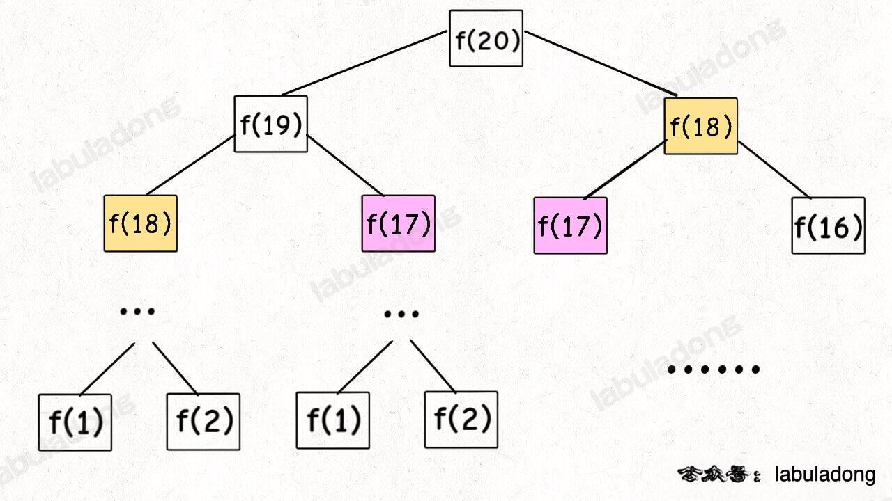
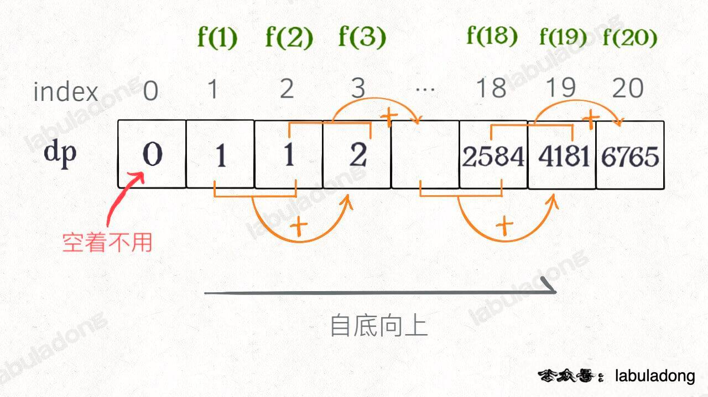
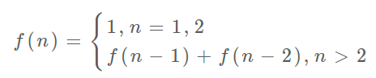

# 动态规划

首先，动态规划问题的一般形式就是求最值。动态规划其实是运筹学的一种最优化方法，只不过在计算机问题上应用比较多，比如说让你求最长递增子序列呀，最小编辑距离呀等等。

既然是要求最值，核心问题是什么呢？求解动态规划的核心问题是穷举。因为要求最值，肯定要把所有可行的答案穷举出来，然后在其中找最值呗。

首先，虽然动态规划的核心思想就是穷举求最值，但是问题可以千变万化，穷举所有可行解其实并不是一件容易的事，需要你熟练掌握递归思维，只有列出正确的「状态转移方程」，才能正确地穷举。而且，你需要判断算法问题是否具备「最优子结构」，是否能够通过子问题的最值得到原问题的最值。另外，动态规划问题存在「重叠子问题」，如果暴力穷举的话效率会很低，所以需要你使用「备忘录」或者「DP table」来优化穷举过程，避免不必要的计算。

以上提到的重叠子问题、最优子结构、状态转移方程就是动态规划三要素。具体什么意思等会会举例详解，但是在实际的算法问题中，写出状态转移方程是最困难的，这也就是为什么很多朋友觉得动态规划问题困难的原因，我来提供我总结的一个思维框架，辅助你思考状态转移方程：

明确 base case -> 明确「状态」-> 明确「选择」 -> 定义 dp 数组/函数的含义

```
# 自顶向下递归的动态规划
def dp(状态1, 状态2, ...):
    for 选择 in 所有可能的选择:
        # 此时的状态已经因为做了选择而改变
        result = 求最值(result, dp(状态1, 状态2, ...))
    return result

# 自底向上迭代的动态规划
# 初始化 base case
dp[0][0][...] = base case
# 进行状态转移
for 状态1 in 状态1的所有取值：
    for 状态2 in 状态2的所有取值：
        for ...
            dp[状态1][状态2][...] = 求最值(选择1，选择2...)

```
## 一、斐波那契数列
### 1. 暴力解法
```

    public int fib(int n) {
        if (n == 1 || n == 2) return 1;
        return fib(n - 1) + fib(n - 2);
    }
```


这个递归树怎么理解？就是说想要计算原问题 f(20)，我就得先计算出子问题 f(19) 和 f(18)，然后要计算 f(19)，我就要先算出子问题 f(18) 和 f(17)，以此类推。最后遇到 f(1) 或者 f(2) 的时候，结果已知，就能直接返回结果，递归树不再向下生长了。

递归算法的时间复杂度怎么计算？就是用子问题个数乘以解决一个子问题需要的时间。

首先计算子问题个数，即递归树中节点的总数。显然二叉树节点总数为指数级别，所以子问题个数为 O(2^n)。

然后计算解决一个子问题的时间，在本算法中，没有循环，只有 f(n - 1) + f(n - 2) 一个加法操作，时间为 O(1)。

所以，这个算法的时间复杂度为二者相乘，即 O(2^n)，指数级别，爆炸。

观察递归树，很明显发现了算法低效的原因：存在大量重复计算，比如 f(18) 被计算了两次，而且你可以看到，以 f(18) 为根的这个递归树体量巨大，多算一遍，会耗费巨大的时间。更何况，还不止 f(18) 这一个节点被重复计算，所以这个算法及其低效。

这就是动态规划问题的第一个性质：重叠子问题。下面，我们想办法解决这个问题。

### 2、带备忘录的递归解法
```
    public int fib2(int n) {
        int [] memory = new int[n + 1];
        return helper(n, memory);
    }

    private int helper(int n, int[] memory) {
        if (n < 2) return n;
        if (memory[n] != 0) return memory[n];
        memory[n] = helper(n-1, memory) + helper(n - 2, memory);
        return memory[n];
    }
```

递归算法的时间复杂度怎么计算？就是用子问题个数乘以解决一个子问题需要的时间。

子问题个数，即图中节点的总数，由于本算法不存在冗余计算，子问题就是 f(1), f(2), f(3) … f(20)，数量和输入规模 n = 20 成正比，所以子问题个数为 O(n)。

解决一个子问题的时间，同上，没有什么循环，时间为 O(1)。

所以，本算法的时间复杂度是 O(n)，比起暴力算法，是降维打击。

至此，带备忘录的递归解法的效率已经和迭代的动态规划解法一样了。实际上，这种解法和常见的动态规划解法已经差不多了，只不过这种解法是「自顶向下」进行「递归」求解，我们更常见的动态规划代码是「自底向上」进行「递推」求解。

啥叫「自顶向下」？注意我们刚才画的递归树（或者说图），是从上向下延伸，都是从一个规模较大的原问题比如说 f(20)，向下逐渐分解规模，直到 f(1) 和 f(2) 这两个 base case，然后逐层返回答案，这就叫「自顶向下」。

啥叫「自底向上」？反过来，我们直接从最底下、最简单、问题规模最小、已知结果的 f(1) 和 f(2)（base case）开始往上推，直到推到我们想要的答案 f(20)。这就是「递推」的思路，这也是动态规划一般都脱离了递归，而是由循环迭代完成计算的原因。

### 3、dp 数组的迭代（递推）解法

有了上一步「备忘录」的启发，我们可以把这个「备忘录」独立出来成为一张表，通常叫做 DP table，在这张表上完成「自底向上」的推算岂不美哉！

```
    public int fib3(int n) {
        if (n == 0) return 0;
        int[] dp = new int[n + 1];
        dp[0] = 0; dp[1] = 1;
        for (int i = 2; i <= n; i++) {
            dp[i] = dp[i - 1] + dp[i - 2];
        }
        return dp[n];
    }
```


画个图就很好理解了，而且你发现这个 DP table 特别像之前那个「剪枝」后的结果，只是反过来算而已。实际上，带备忘录的递归解法中的「备忘录」，最终完成后就是这个 DP table，所以说这两种解法其实是差不多的，大部分情况下，效率也基本相同。

这里，引出「状态转移方程」这个名词，实际上就是描述问题结构的数学形式：



为啥叫「状态转移方程」？其实就是为了听起来高端。

f(n) 的函数参数会不断变化，所以你把参数 n 想做一个状态，这个状态 n 是由状态 n - 1 和状态 n - 2 转移（相加）而来，这就叫状态转移，仅此而已。

你会发现，上面的几种解法中的所有操作，例如 return f(n - 1) + f(n - 2)，dp[i] = dp[i - 1] + dp[i - 2]，以及对备忘录或 DP table 的初始化操作，都是围绕这个方程式的不同表现形式。

可见列出「状态转移方程」的重要性，它是解决问题的核心，而且很容易发现，其实状态转移方程直接代表着暴力解法。

千万不要看不起暴力解，动态规划问题最困难的就是写出这个暴力解，即状态转移方程。

只要写出暴力解，优化方法无非是用备忘录或者 DP table，再无奥妙可言。

这个例子的最后，讲一个细节优化。

细心的读者会发现，根据斐波那契数列的状态转移方程，当前状态只和之前的两个状态有关，其实并不需要那么长的一个 DP table 来存储所有的状态，只要想办法存储之前的两个状态就行了。

所以，可以进一步优化，把空间复杂度降为 O(1)。这也就是我们最常见的计算斐波那契数的算法：

```
    public int fib4(int n) {
        if (n < 2) return n;
        int dp_i_1 = 1, dp_i_2 = 0;
        for (int i = 2; i <= n; i++) {
            int dp_i = dp_i_1 + dp_i_2;
            dp_i_2 = dp_i_1;
            dp_i_1 = dp_i;
        }
        return dp_i_1;
    }
```